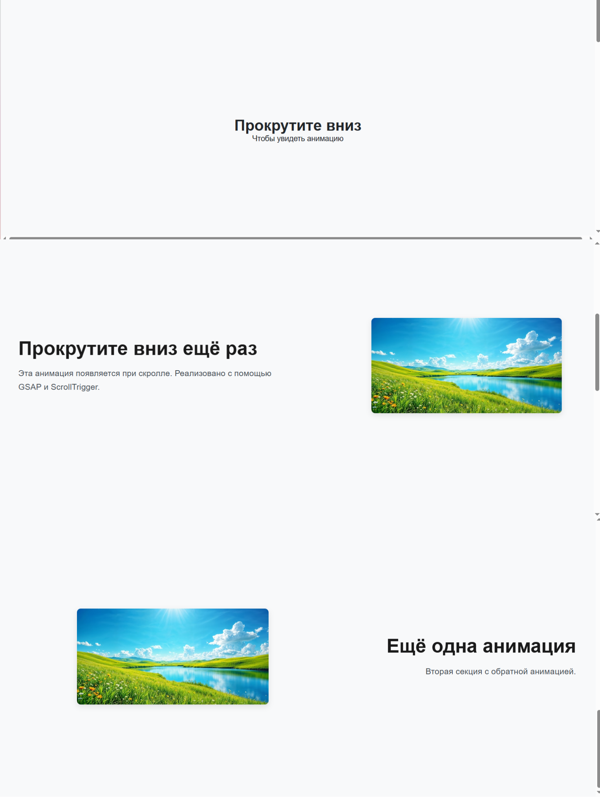

# GSAP Scroll Animation Demo

Анимация появления элементов при прокрутке страницы, реализованная на чистом JavaScript с использованием библиотеки [GSAP](https://greensock.com/gsap/) и плагина [ScrollTrigger](https://greensock.com/scrolltrigger/).

Демо идеально подходит для сайтов с акцентом на UX, плавные переходы и микровзаимодействия.

## 🔧 Особенности

- Анимация появления текста и изображений при скролле
- Адаптивный дизайн (поддержка мобильных устройств)
- Чистый HTML, CSS, JavaScript — без фреймворков
- Поддержка современных браузеров
- Решение проблемы с первой секцией: добавлена вводная секция, чтобы анимации запускались корректно

## 🚀 Как работает

1. Пользователь видит вводную секцию: *"Прокрутите вниз"*
2. При прокрутке блоки плавно появляются с эффектом движения слева/справа
3. Анимация проигрывается только один раз (`once: true`)
4. Используется `force3D` и принудительное обновление ScrollTrigger для стабильной работы

## 🛠 Технологии

- **HTML5** — семантическая верстка
- **CSS3** — адаптивность, BEM, тени, border-radius
- **Vanilla JavaScript (ES6+)** — логика анимаций
- **GSAP 3 + ScrollTrigger** — управление анимациями при скролле

## 🌐 Демо

👉 [yulya-vovk.github.io/gsap-scroll-animation](https://yulya-vovk.github.io/gsap-scroll-animation)

## 💾 Скриншот



## 📦 Установка и запуск

1. Клонируй репозиторий:
   ```bash
   git clone https://github.com/yulya-vovk/gsap-scroll-animation.git
